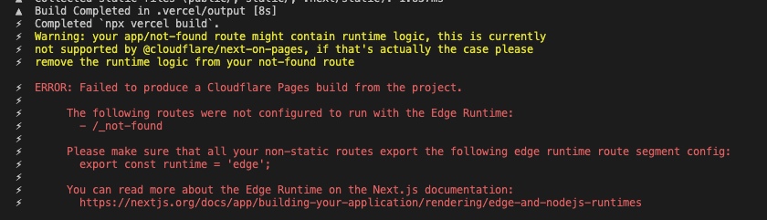

# next-on-pages issue 598 reproduction

## reproduction steps

Install the dependencies:
```
npm i
```

Build and preview the next-on-pages application:
```
npm run pages:build
npm run pages:dev
```

Notice that everything is working as expected

In `app/layout.tsx` uncomment either (or both) the `headers` or `cookies` block of code and see that
```
npm run pages:build
```
no longer produces a working application, it generates the following error instead:


also notice that uncommenting the first block of code doesn't break the application, showing that generic server side logic in the layout component doesn't seem to cause this issue.